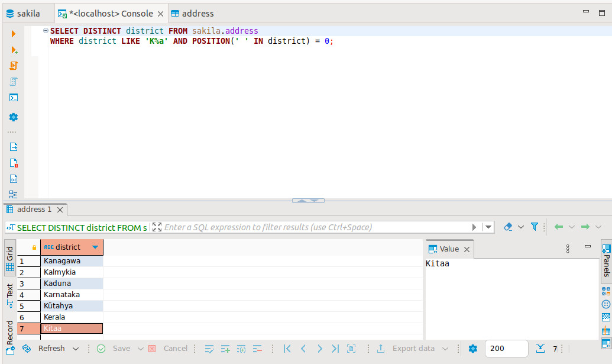

## Домашнее задание к занятию "SQL. Часть 1" - Карих Елена
---
### Задание 1

Получите уникальные названия районов из таблицы с адресами, которые начинаются на “K” и заканчиваются на “a” и не содержат пробелов.

### Решение 1

Запрос:

```
SELECT DISTINCT district FROM sakila.address 
WHERE district LIKE 'K%a' AND POSITION(' ' IN district) = 0;
```



---
### Задание 2

Получите из таблицы платежей за прокат фильмов информацию по платежам, которые выполнялись в промежуток с 15 июня 2005 года по 18 июня 2005 года включительно и стоимость которых превышает 10.00.

### Решение 2

Запрос:

```
ELECT * FROM sakila.payment
WHERE DATE(payment_date) BETWEEN '2005-06-15' and '2005-06-18' AND amount > 10.00;
```


---
### Задание 3

Получите последние пять аренд фильмов.

### Решение 3

Запрос:

```
SELECT * FROM sakila.rental 
ORDER BY rental_date DESC LIMIT 5;
```


---
### Задание 4

Одним запросом получите активных покупателей, имена которых Kelly или Willie.
Сформируйте вывод в результат таким образом:

- все буквы в фамилии и имени из верхнего регистра переведите в нижний регистр,
- замените буквы 'll' в именах на 'pp'.

### Решение 4

Запрос:

```
SELECT REPLACE(LOWER(first_name), 'll', 'pp') AS Name, LOWER(last_name) AS Family , active FROM sakila.customer 
WHERE active =1 AND (first_name LIKE 'Kelly' OR first_name  LIKE 'Willie');
```


---
### Задание 5

Выведите Email каждого покупателя, разделив значение Email на две отдельных колонки: в первой колонке должно быть значение, указанное до @, во второй — значение, указанное после @.

### Решение 5

Запрос:

```
SELECT SUBSTRING_INDEX(email, '@', 1) AS Login, SUBSTRING_INDEX(email, '@', -1) AS Domen FROM sakila.customer;
```


---
### Задание 6

Доработайте запрос из предыдущего задания, скорректируйте значения в новых колонках: первая буква должна быть заглавной, остальные — строчными.

### Решение 6

Запрос:

```
SELECT CONCAT(SUBSTRING(SUBSTRING_INDEX(email, '@', 1), 1,1), LOWER(SUBSTRING(SUBSTRING_INDEX(email, '@', 1), 1))) 
AS Login, SUBSTRING_INDEX(email, '@', -1) AS Domen FROM sakila.customer;
```


---

